froked from https://github.com/HKUDS/DeepCode

<div align="center">

<table style="border: none; margin: 0 auto; padding: 0; border-collapse: collapse;">
<tr>
<td align="center" style="vertical-align: middle; padding: 10px; border: none; width: 250px;">
  
</td>
<td align="left" style="vertical-align: middle; padding: 10px 0 10px 30px; border: none;">
  <pre style="font-family: 'Courier New', monospace; font-size: 16px; color: #0EA5E9; margin: 0; padding: 0; text-shadow: 0 0 10px #0EA5E9, 0 0 20px rgba(14,165,233,0.5); line-height: 1.2; transform: skew(-1deg, 0deg); display: block;">    ██████╗ ███████╗███████╗██████╗  ██████╗ ██████╗ ██████╗ ███████╗
    ██╔══██╗██╔════╝██╔════╝██╔══██╗██╔════╝██╔═══██╗██╔══██╗██╔════╝
    ██║  ██║█████╗  █████╗  ██████╔╝██║     ██║   ██║██║  ██║█████╗
    ██║  ██║██╔══╝  ██╔══╝  ██╔═══╝ ██║     ██║   ██║██║  ██║██╔══╝
    ██████╔╝███████╗███████╗██║     ╚██████╗╚██████╔╝██████╔╝███████╗
    ╚═════╝ ╚══════╝╚══════╝╚═╝      ╚═════╝ ╚═════╝ ╚═════╝ ╚══════╝</pre>
</td>
</tr>
</table>

<div align="center">
<a href="https://trendshift.io/repositories/14665" target="_blank"></a>
</div>

<!--  -->

#  DeepCode: Open Agentic Coding

### *Advancing Code Generation with Multi-Agent Systems*

<!-- <p align="center">
  

  
  
  
</p> -->
<p>
  <a href="https://github.com/HKUDS/DeepCode/stargazers"></a>
  <a href='https://arxiv.org/abs/2512.07921'></a>
  
  <!-- <a href="https://pypi.org/project/deepcode-hku/"></a> -->
</p>
<p>
  <a href="https://discord.gg/yF2MmDJyGJ"></a>
  <a href="https://github.com/HKUDS/DeepCode/issues/11"></a>
</p>
<div align="center">
  <div style="width: 100%; height: 2px; margin: 20px 0; background: linear-gradient(90deg, transparent, #00d9ff, transparent);"></div>
</div>

<div align="center">
  <a href="#-quick-start" style="text-decoration: none;">
    
  </a>
</div>

<div align="center" style="margin-top: 10px;">
  <a href="README.md">
    
  </a>
  <a href="README_ZH.md">
    
  </a>
</div>

### 🖥️ **Interface Showcase**

<table align="center" width="100%" style="border: none; border-collapse: collapse; margin: 30px 0;">
<tr>
<td width="50%" align="center" style="vertical-align: top; padding: 20px;">

#### 🖥️ **CLI Interface**
**Terminal-Based Development**

<div align="center">

  

  <div style="background: linear-gradient(135deg, #2D3748 0%, #4A5568 100%); border-radius: 12px; padding: 15px; margin: 15px 0; color: white;">
    <strong>🚀 Advanced Terminal Experience</strong><br/>
    <small>⚡ Fast command-line workflow<br/>🔧 Developer-friendly interface<br/>📊 Real-time progress tracking</small>
  </div>

  *Professional terminal interface for advanced users and CI/CD integration*
</div>

</td>
<td width="50%" align="center" style="vertical-align: top; padding: 20px;">

#### 🌐 **Web Interface**
**Visual Interactive Experience**

<div align="center">

  

  <div style="background: linear-gradient(135deg, #0EA5E9 0%, #00D4FF 100%); border-radius: 12px; padding: 15px; margin: 15px 0; color: white;">
    <strong>🎨 Modern Web Dashboard</strong><br/>
    <small>🖱️ Intuitive drag-and-drop<br/>📱 Responsive design<br/>🎯 Visual progress tracking</small>
  </div>

  *Beautiful web interface with streamlined workflow for all skill levels*
</div>

</td>
</tr>
</table>

---

<div align="center">

### 🎬 **Introduction Video**

<div style="margin: 20px 0;">
  <a href="https://youtu.be/PRgmP8pOI08" target="_blank">
    
  </a>
</div>

*🎯 **Watch our complete introduction** - See how DeepCode transforms research papers and natural language into production-ready code*

<p>
  <a href="https://youtu.be/PRgmP8pOI08" target="_blank">
    
  </a>
</p>

</div>

---


> *"Where AI Agents Transform Ideas into Production-Ready Code"*

</div>

---

## 📑 Table of Contents

- [📰 News](#-news)
- [🚀 Key Features](#-key-features)
- [🏗️ Architecture](#️-architecture)
- [📊 Experimental Results](#-experimental-results)
- [🚀 Quick Start](#-quick-start)
- [🤖 nanobot Integration (Feishu Chatbot)](#-nanobot-integration-feishu-chatbot)
- [💡 Examples](#-examples)
  - [🎬 Live Demonstrations](#-live-demonstrations)
- [⭐ Star History](#-star-history)
- [📄 License](#-license)


---

## 📰 News

🎉 **[2025-02] nanobot ✖️ DeepCode. Just chat naturally with openclaw/nanobot to handle your coding tasks:**

<div align="center">
<table><tr>
<td align="center"><a href="https://github.com/HKUDS/DeepCode"></a></td>
<td align="center"><h2>✦</h2></td>
<td align="center"><a href="https://github.com/HKUDS/nanobot"></a></td>
</tr></table>
</div>

- [nanobot](https://github.com/HKUDS/nanobot) nanobot now powers your agentic coding & engineering! 🤖💻
- Step away from your laptop — make vibe coding even more vibe! Code directly from your phone! 📱✨
- One-command deploy: `./nanobot/run_nanobot.sh` → **[Setup Guide →](#-nanobot-integration-feishu-chatbot)**

<div align="center">
<table width="100%"><tr>
<td width="50%" align="center">
  
</td>
<td width="50%" align="center">
  
</td>
</tr></table>
<sub><em>Feishu Bot in Action — Natural language → Full code generation with setup instructions</em></sub>
</div>

---

🎉 **[2025-02] New Web UI Experience Upgrade!**

- 🔄 **User-in-Loop Interaction**: Support real-time user interaction during workflows - AI asks clarifying questions directly in the chat
- 💬 **Inline Interaction Design**: Interaction prompts appear naturally within the chat flow for a seamless experience
- 🚀 **One-Click Launch**: Simply run `deepcode` to start the new UI (cross-platform: Windows/macOS/Linux)
- 🔧 **Improved Process Management**: Enhanced service start/stop mechanism with automatic port cleanup
- 📡 **WebSocket Real-time Communication**: Fixed message loss issues, ensuring proper interaction state synchronization

<div align="center">
  
  <br/>
  <sub><em>DeepCode New Web UI - Modern React-based Interface</em></sub>
</div>

---

🎉 **[2025-10-28] DeepCode Achieves SOTA on PaperBench!**

DeepCode sets new benchmarks on OpenAI's PaperBench Code-Dev across all categories:

- 🏆 **Surpasses Human Experts**: **75.9%** (DeepCode) vs Top Machine Learning PhDs 72.4% (+3.5%).
- 🥇 **Outperforms SOTA Commercial Code Agents**: **84.8%** (DeepCode) vs Leading Commercial Code Agents (+26.1%) (Cursor, Claude Code, and Codex).
- 🔬 **Advances Scientific Coding**: **73.5%** (DeepCode) vs PaperCoder 51.1% (+22.4%).
- 🚀 **Beats LLM Agents**: **73.5%** (DeepCode) vs best LLM frameworks 43.3% (+30.2%).

---

## 🚀 Key Features

<br/>

<table align="center" width="100%" style="border: none; table-layout: fixed;">
<tr>
<td width="30%" align="center" style="vertical-align: top; padding: 20px;">

<div style="height: 80px; display: flex; align-items: center; justify-content: center;">
<h3 style="margin: 0; padding: 0;">🚀 <strong>Paper2Code</strong></h3>
</div>

<div align="center" style="margin: 15px 0;">
  
</div>

<div style="height: 80px; display: flex; align-items: center; justify-content: center;">
<p align="center"><strong>Automated Implementation of Complex Algorithms</strong></p>
</div>

<div style="height: 60px; display: flex; align-items: center; justify-content: center;">
<p align="center">Effortlessly converts complex algorithms from research papers into <strong>high-quality</strong>, <strong>production-ready</strong> code, accelerating algorithm reproduction.</p>
</div>


</td>
<td width="30%" align="center" style="vertical-align: top; padding: 20px;">

<div style="height: 80px; display: flex; align-items: center; justify-content: center;">
<h3 style="margin: 0; padding: 0;">🎨 <strong>Text2Web</strong></h3>
</div>

<div align="center" style="margin: 15px 0;">
  
</div>

<div style="height: 80px; display: flex; align-items: center; justify-content: center;">
<p align="center"><strong>Automated Front-End Web Development</strong></p>
</div>

<div style="height: 60px; display: flex; align-items: center; justify-content: center;">
<p align="center">Translates plain textual descriptions into <strong>fully functional</strong>, <strong>visually appealing</strong> front-end web code for rapid interface creation.</p>
</div>


</td>
<td width="30%" align="center" style="vertical-align: top; padding: 20px;">

<div style="height: 80px; display: flex; align-items: center; justify-content: center;">
<h3 style="margin: 0; padding: 0;">⚙️ <strong>Text2Backend</strong></h3>
</div>

<div align="center" style="margin: 15px 0;">
  
</div>

<div style="height: 80px; display: flex; align-items: center; justify-content: center;">
<p align="center"><strong>Automated Back-End Development</strong></p>
</div>

<div style="height: 60px; display: flex; align-items: center; justify-content: center;">
<p align="center">Generates <strong>efficient</strong>, <strong>scalable</strong>, and <strong>feature-rich</strong> back-end code from simple text inputs, streamlining server-side development.</p>
</div>


</td>
</tr>
</table>

<br/>

---

## 📊 Experimental Results

<div align="center">
    <br>
</div>
<br/>

We evaluate **DeepCode** on the [*PaperBench*](https://openai.com/index/paperbench/) benchmark (released by OpenAI), a rigorous testbed requiring AI agents to independently reproduce 20 ICML 2024 papers from scratch. The benchmark comprises 8,316 gradable components assessed using SimpleJudge with hierarchical weighting.

Our experiments compare DeepCode against four baseline categories: **(1) Human Experts**, **(2) State-of-the-Art Commercial Code Agents**, **(3) Scientific Code Agents**, and **(4) LLM-Based Agents**.

### ① 🧠 Human Expert Performance (Top Machine Learning PhD)

**DeepCode: 75.9% vs. Top Machine Learning PhD: 72.4% (+3.5%)**

DeepCode achieves **75.9%** on the 3-paper human evaluation subset, **surpassing the best-of-3 human expert baseline (72.4%) by +3.5 percentage points**. This demonstrates that our framework not only matches but exceeds expert-level code reproduction capabilities, representing a significant milestone in autonomous scientific software engineering.

### ② 💼 State-of-the-Art Commercial Code Agents

**DeepCode: 84.8% vs. Best Commercial Agent: 58.7% (+26.1%)**

On the 5-paper subset, DeepCode substantially outperforms leading commercial coding tools:
- Cursor: 58.4%
- Claude Code: 58.7%
- Codex: 40.0%
- **DeepCode: 84.8%**

This represents a **+26.1% improvement** over the leading commercial code agent. All commercial agents utilize Claude Sonnet 4.5 or GPT-5 Codex-high, highlighting that **DeepCode's superior architecture**—rather than base model capability—drives this performance gap.

### ③ 🔬 Scientific Code Agents

**DeepCode: 73.5% vs. PaperCoder: 51.1% (+22.4%)**

Compared to PaperCoder (**51.1%**), the state-of-the-art scientific code reproduction framework, DeepCode achieves **73.5%**, demonstrating a **+22.4% relative improvement**. This substantial margin validates our multi-module architecture combining planning, hierarchical task decomposition, code generation, and iterative debugging over simpler pipeline-based approaches.

### ④ 🤖 LLM-Based Agents

**DeepCode: 73.5% vs. Best LLM Agent: 43.3% (+30.2%)**

DeepCode significantly outperforms all tested LLM agents:
- Claude 3.5 Sonnet + IterativeAgent: 27.5%
- o1 + IterativeAgent (36 hours): 42.4%
- o1 BasicAgent: 43.3%
- **DeepCode: 73.5%**

The **+30.2% improvement** over the best-performing LLM agent demonstrates that sophisticated agent scaffolding, rather than extended inference time or larger models, is critical for complex code reproduction tasks.

---

### 🎯 **Autonomous Self-Orchestrating Multi-Agent Architecture**

**The Challenges**:

- 📄 **Implementation Complexity**: Converting academic papers and complex algorithms into working code requires significant technical effort and domain expertise

- 🔬 **Research Bottleneck**: Researchers spend valuable time implementing algorithms instead of focusing on their core research and discovery work

- ⏱️ **Development Delays**: Product teams experience long wait times between concept and testable prototypes, slowing down innovation cycles

- 🔄 **Repetitive Coding**: Developers repeatedly implement similar patterns and functionality instead of building on existing solutions

**DeepCode** addresses these workflow inefficiencies by providing reliable automation for common development tasks, streamlining your development workflow from concept to code.

```mermaid
flowchart LR
    A["📄 Research Papers<br/>💬 Text Prompts<br/>🌐 URLs & Document<br/>📎 Files: PDF, DOC, PPTX, TXT, HTML"] --> B["🧠 DeepCode<br/>Multi-Agent Engine"]
    B --> C["🚀 Algorithm Implementation <br/>🎨 Frontend Development <br/>⚙️ Backend Development"]

    style A fill:#ff6b6b,stroke:#c0392b,stroke-width:2px,color:#000
    style B fill:#00d4ff,stroke:#0984e3,stroke-width:3px,color:#000
    style C fill:#00b894,stroke:#00a085,stroke-width:2px,color:#000
```

<div align="center">



</div>

---

## 🏗️ Architecture

### 📊 **System Overview**

**DeepCode** is an AI-powered development platform that automates code generation and implementation tasks. Our multi-agent system handles the complexity of translating requirements into functional, well-structured code, allowing you to focus on innovation rather than implementation details.

🎯 **Technical Capabilities**:

🧬 **Research-to-Production Pipeline**<br>
Multi-modal document analysis engine that extracts algorithmic logic and mathematical models from academic papers. Generates optimized implementations with proper data structures while preserving computational complexity characteristics.

🪄 **Natural Language Code Synthesis**<br>
Context-aware code generation using fine-tuned language models trained on curated code repositories. Maintains architectural consistency across modules while supporting multiple programming languages and frameworks.

⚡ **Automated Prototyping Engine**<br>
Intelligent scaffolding system generating complete application structures including database schemas, API endpoints, and frontend components. Uses dependency analysis to ensure scalable architecture from initial generation.

💎 **Quality Assurance Automation**<br>
Integrated static analysis with automated unit test generation and documentation synthesis. Employs AST analysis for code correctness and property-based testing for comprehensive coverage.

🔮 **CodeRAG Integration System**<br>
Advanced retrieval-augmented generation combining semantic vector embeddings with graph-based dependency analysis. Automatically discovers optimal libraries and implementation patterns from large-scale code corpus.

---

### 🔧 **Core Techniques**

- 🧠 **Intelligent Orchestration Agent**: Central decision-making system that coordinates workflow phases and analyzes requirements. Employs dynamic planning algorithms to adapt execution strategies in real-time based on evolving project complexity. Dynamically selects optimal processing strategies for each implementation step. <br>

- 💾 **Efficient Memory Mechanism**: Advanced context engineering system that manages large-scale code contexts efficiently. Implements hierarchical memory structures with intelligent compression for handling complex codebases. This component enables instant retrieval of implementation patterns and maintains semantic coherence across extended development sessions. <br>

- 🔍 **Advanced CodeRAG System**: Global code comprehension engine that analyzes complex inter-dependencies across repositories. Performs cross-codebase relationship mapping to understand architectural patterns from a holistic perspective. This module leverages dependency graphs and semantic analysis to provide globally-aware code recommendations during implementation.

---

### 🤖 **Multi-Agent Architecture of DeepCode**:

- **🎯 Central Orchestrating Agent**: Orchestrates entire workflow execution and makes strategic decisions. Coordinates specialized agents based on input complexity analysis. Implements dynamic task planning and resource allocation algorithms. <br>

- **📝 Intent Understanding Agent**: Performs deep semantic analysis of user requirements to decode complex intentions. Extracts functional specifications and technical constraints through advanced NLP processing. Transforms ambiguous human descriptions into precise, actionable development specifications with structured task decomposition. <br>

- **📄 Document Parsing Agent**: Processes complex technical documents and research papers with advanced parsing capabilities. Extracts algorithms and methodologies using document understanding models. Converts academic concepts into practical implementation specifications through intelligent content analysis. <br>

- **🏗️ Code Planning Agent**: Performs architectural design and technology stack optimization. Dynamic planning for adaptive development roadmaps. Enforces coding standards and generates modular structures through automated design pattern selection.<br>

- **🔍 Code Reference Mining Agent**: Discovers relevant repositories and frameworks through intelligent search algorithms. Analyzes codebases for compatibility and integration potential. Provides recommendations based on similarity metrics and automated dependency analysis. <br>

- **📚 Code Indexing Agent**: Builds comprehensive knowledge graphs of discovered codebases. Maintains semantic relationships between code components. Enables intelligent retrieval and cross-reference capabilities. <br>

- **🧬 Code Generation Agent**: Synthesizes gathered information into executable code implementations. Creates functional interfaces and integrates discovered components. Generates comprehensive test suites and documentation for reproducibility.

---

#### 🛠️ **Implementation Tools Matrix**

**🔧 Powered by MCP (Model Context Protocol)**

DeepCode leverages the **Model Context Protocol (MCP)** standard to seamlessly integrate with various tools and services. This standardized approach ensures reliable communication between AI agents and external systems, enabling powerful automation capabilities.

##### 📡 **MCP Servers & Tools**

| 🛠️ **MCP Server** | 🔧 **Primary Function** | 💡 **Purpose & Capabilities** |
|-------------------|-------------------------|-------------------------------|
| **🔍 brave** | Web Search Engine | Real-time information retrieval via Brave Search API |
| **🌐 bocha-mcp** | Alternative Search | Secondary search option with independent API access |
| **📂 filesystem** | File System Operations | Local file and directory management, read/write operations |
| **🌐 fetch** | Web Content Retrieval | Fetch and extract content from URLs and web resources |
| **📥 github-downloader** | Repository Management | Clone and download GitHub repositories for analysis |
| **📋 file-downloader** | Document Processing | Download and convert files (PDF, DOCX, etc.) to Markdown |
| **⚡ command-executor** | System Commands | Execute bash/shell commands for environment management |
| **🧬 code-implementation** | Code Generation Hub | Comprehensive code reproduction with execution and testing |
| **📚 code-reference-indexer** | Smart Code Search | Intelligent indexing and search of code repositories |
| **📄 document-segmentation** | Smart Document Analysis | Intelligent document segmentation for large papers and technical documents |

##### 🔧 **Legacy Tool Functions** *(for reference)*

| 🛠️ **Function** | 🎯 **Usage Context** |
|-----------------|---------------------|
| **📄 read_code_mem** | Efficient code context retrieval from memory |
| **✍️ write_file** | Direct file content generation and modification |
| **🐍 execute_python** | Python code testing and validation |
| **📁 get_file_structure** | Project structure analysis and organization |
| **⚙️ set_workspace** | Dynamic workspace and environment configuration |
| **📊 get_operation_history** | Process monitoring and operation tracking |


---

🎛️ **Multi-Interface Framework**<br>
RESTful API with CLI and web frontends featuring real-time code streaming, interactive debugging, and extensible plugin architecture for CI/CD integration.

**🚀 Multi-Agent Intelligent Pipeline:**

<div align="center">

### 🌟 **Intelligence Processing Flow**

<table align="center" width="100%" style="border: none; border-collapse: collapse;">
<tr>
<td colspan="3" align="center" style="padding: 20px; background: linear-gradient(135deg, #667eea 0%, #764ba2 100%); border-radius: 15px; color: white; font-weight: bold;">
💡 <strong>INPUT LAYER</strong><br/>
📄 Research Papers • 💬 Natural Language • 🌐 URLs • 📋 Requirements
</td>
</tr>
<tr><td colspan="3" height="20"></td></tr>
<tr>
<td colspan="3" align="center" style="padding: 15px; background: linear-gradient(135deg, #ff6b6b 0%, #ee5a24 100%); border-radius: 12px; color: white; font-weight: bold;">
🎯 <strong>CENTRAL ORCHESTRATION</strong><br/>
Strategic Decision Making • Workflow Coordination • Agent Management
</td>
</tr>
<tr><td colspan="3" height="15"></td></tr>
<tr>
<td align="center" style="padding: 12px; background: linear-gradient(135deg, #3742fa 0%, #2f3542 100%); border-radius: 10px; color: white; width: 50%;">
📝 <strong>TEXT ANALYSIS</strong><br/>
<small>Requirement Processing</small>
</td>
<td width="10"></td>
<td align="center" style="padding: 12px; background: linear-gradient(135deg, #8c7ae6 0%, #9c88ff 100%); border-radius: 10px; color: white; width: 50%;">
📄 <strong>DOCUMENT ANALYSIS</strong><br/>
<small>Paper & Spec Processing</small>
</td>
</tr>
<tr><td colspan="3" height="15"></td></tr>
<tr>
<td colspan="3" align="center" style="padding: 15px; background: linear-gradient(135deg, #00d2d3 0%, #54a0ff 100%); border-radius: 12px; color: white; font-weight: bold;">
📋 <strong>REPRODUCTION PLANNING</strong><br/>
Deep Paper Analysis • Code Requirements Parsing • Reproduction Strategy Development
</td>
</tr>
<tr><td colspan="3" height="15"></td></tr>
<tr>
<td align="center" style="padding: 12px; background: linear-gradient(135deg, #ffa726 0%, #ff7043 100%); border-radius: 10px; color: white; width: 50%;">
🔍 <strong>REFERENCE ANALYSIS</strong><br/>
<small>Repository Discovery</small>
</td>
<td width="10"></td>
<td align="center" style="padding: 12px; background: linear-gradient(135deg, #e056fd 0%, #f368e0 100%); border-radius: 10px; color: white; width: 50%;">
📚 <strong>CODE INDEXING</strong><br/>
<small>Knowledge Graph Building</small>
</td>
</tr>
<tr><td colspan="3" height="15"></td></tr>
<tr>
<td colspan="3" align="center" style="padding: 15px; background: linear-gradient(135deg, #26de81 0%, #20bf6b 100%); border-radius: 12px; color: white; font-weight: bold;">
🧬 <strong>CODE IMPLEMENTATION</strong><br/>
Implementation Generation • Testing • Documentation
</td>
</tr>
<tr><td colspan="3" height="15"></td></tr>
<tr>
<td colspan="3" align="center" style="padding: 20px; background: linear-gradient(135deg, #045de9 0%, #09c6f9 100%); border-radius: 15px; color: white; font-weight: bold;">
⚡ <strong>OUTPUT DELIVERY</strong><br/>
📦 Complete Codebase • 🧪 Test Suite • 📚 Documentation • 🚀 Deployment Ready
</td>
</tr>
</table>

</div>

<div align="center">
<br/>

### 🔄 **Process Intelligence Features**

<table align="center" style="border: none;">
<tr>
<td align="center" width="25%" style="padding: 15px;">
<div style="background: #f8f9fa; border-radius: 10px; padding: 15px; border-left: 4px solid #ff6b6b;">
<h4>🎯 Adaptive Flow</h4>
<p><small>Dynamic agent selection based on input complexity</small></p>
</div>
</td>
<td align="center" width="25%" style="padding: 15px;">
<div style="background: #f8f9fa; border-radius: 10px; padding: 15px; border-left: 4px solid #4ecdc4;">
<h4>🧠 Smart Coordination</h4>
<p><small>Intelligent task distribution and parallel processing</small></p>
</div>
</td>
<td align="center" width="25%" style="padding: 15px;">
<div style="background: #f8f9fa; border-radius: 10px; padding: 15px; border-left: 4px solid #45b7d1;">
<h4>🔍 Context Awareness</h4>
<p><small>Deep understanding through CodeRAG integration</small></p>
</div>
</td>
<td align="center" width="25%" style="padding: 15px;">
<div style="background: #f8f9fa; border-radius: 10px; padding: 15px; border-left: 4px solid #96ceb4;">
<h4>⚡ Quality Assurance</h4>
<p><small>Automated testing and validation throughout</small></p>
</div>
</td>
</tr>
</table>

</div>

---


## 🚀 Quick Start

### 📋 **Prerequisites**

Before installing DeepCode, ensure you have the following:

| Requirement | Version | Purpose |
|-------------|---------|---------|
| **Python** | 3.9+ | Core runtime |
| **Node.js** | 18+ | New UI frontend |
| **npm** | 8+ | Package management |

```bash
# Check your versions
python --version   # Should be 3.9+
node --version     # Should be 18+
npm --version      # Should be 8+
```

<details>
<summary><strong>📥 Install Node.js (if not installed)</strong></summary>

```bash
# macOS (using Homebrew)
brew install node

# Ubuntu/Debian
curl -fsSL https://deb.nodesource.com/setup_20.x | sudo -E bash -
sudo apt-get install -y nodejs

# Windows
# Download from https://nodejs.org/
```

</details>

### 📦 **Step 1: Installation**

Choose one of the following installation methods:

#### ⚡ **Direct Installation (Recommended)**

```bash
# 🚀 Install DeepCode package directly
pip install deepcode-hku

# 🔑 Download configuration files
curl -O https://raw.githubusercontent.com/HKUDS/DeepCode/main/mcp_agent.config.yaml
curl -O https://raw.githubusercontent.com/HKUDS/DeepCode/main/mcp_agent.secrets.yaml
```

#### 🔧 **Development Installation (From Source)**

<details>
<summary><strong>📂 Click to expand development installation options</strong></summary>

##### 🔥 **Using UV (Recommended for Development)**

```bash
git clone https://github.com/HKUDS/DeepCode.git
cd DeepCode/

curl -LsSf https://astral.sh/uv/install.sh | sh
uv venv --python=3.13
source .venv/bin/activate  # On Windows: .venv\Scripts\activate
uv pip install -r requirements.txt

# Install frontend dependencies
npm install --prefix new_ui/frontend
```

##### 🐍 **Using Traditional pip**

```bash
git clone https://github.com/HKUDS/DeepCode.git
cd DeepCode/

pip install -r requirements.txt

# Install frontend dependencies
npm install --prefix new_ui/frontend
```

</details>

### 🔧 **Step 2: Configuration**

> The following configuration applies to **all installation methods** (pip, UV, source, and Docker).

#### 🔑 API Keys *(required)*

Edit `mcp_agent.secrets.yaml` with your API keys:

```yaml
# At least ONE provider API key is required
openai:
  api_key: "your_openai_api_key"
  base_url: "https://openrouter.ai/api/v1"  # Optional: for OpenRouter or custom endpoints

anthropic:
  api_key: "your_anthropic_api_key"  # For Claude models

google:
  api_key: "your_google_api_key"     # For Gemini models
```

#### 🤖 LLM Provider *(optional)*

Edit `mcp_agent.config.yaml` to choose your preferred LLM provider (line ~106):

```yaml
# Options: "google", "anthropic", "openai"
# If not set or unavailable, will automatically fallback to first available provider
llm_provider: "google"
```

#### 🔍 Search API Keys *(optional)*

Configure web search in `mcp_agent.config.yaml`:

```yaml
# For Brave Search (default) — set in brave.env section (line ~28)
brave:
  env:
    BRAVE_API_KEY: "your_brave_api_key_here"

# For Bocha-MCP (alternative) — set in bocha-mcp.env section (line ~74)
bocha-mcp:
  env:
    BOCHA_API_KEY: "your_bocha_api_key_here"
```

#### 📄 Document Segmentation *(optional)*

Control document processing in `mcp_agent.config.yaml`:

```yaml
document_segmentation:
  enabled: true          # true/false — whether to use intelligent document segmentation
  size_threshold_chars: 50000  # Document size threshold to trigger segmentation
```

<details>
<summary><strong>🪟 Windows Users: Additional MCP Server Configuration</strong></summary>

If you're using Windows, you may need to configure MCP servers manually in `mcp_agent.config.yaml`:

```bash
# 1. Install MCP servers globally
npm i -g @modelcontextprotocol/server-brave-search
npm i -g @modelcontextprotocol/server-filesystem

# 2. Find your global node_modules path
npm -g root
```

Then update your `mcp_agent.config.yaml` to use absolute paths:

```yaml
mcp:
  servers:
    brave:
      command: "node"
      args: ["C:/Program Files/nodejs/node_modules/@modelcontextprotocol/server-brave-search/dist/index.js"]
    filesystem:
      command: "node"
      args: ["C:/Program Files/nodejs/node_modules/@modelcontextprotocol/server-filesystem/dist/index.js", "."]
```

> **Note**: Replace the path with your actual global node_modules path from step 2.

</details>

<details>
<summary><strong>🔍 Search Server Configuration (Optional)</strong></summary>

DeepCode supports multiple search servers for web search functionality. You can configure your preferred option in `mcp_agent.config.yaml`:

```yaml
# Default search server configuration
# Options: "brave" or "bocha-mcp"
default_search_server: "brave"
```

**Available Options:**
- **🔍 Brave Search** (`"brave"`): Default option with high-quality search results. Requires `BRAVE_API_KEY`. Recommended for most users.
- **🌐 Bocha-MCP** (`"bocha-mcp"`): Alternative search server. Requires `BOCHA_API_KEY`. Uses local Python server implementation.

**Full MCP server configuration in mcp_agent.config.yaml:**
```yaml
# For Brave Search (default) - around line 28
brave:
  command: "npx"
  args: ["-y", "@modelcontextprotocol/server-brave-search"]
  env:
    BRAVE_API_KEY: "your_brave_api_key_here"

# For Bocha-MCP (alternative) - around line 74
bocha-mcp:
  command: "python"
  args: ["tools/bocha_search_server.py"]
  env:
    PYTHONPATH: "."
    BOCHA_API_KEY: "your_bocha_api_key_here"
```

> **💡 Tip**: Both search servers require API key configuration. Choose the one that best fits your API access and requirements.

</details>

### ⚡ **Step 3: Launch Application**

Choose your preferred launch method:

<table width="100%">
<tr>
<th width="33%">🐳 Docker (Recommended)</th>
<th width="33%">🚀 Local (<code>deepcode</code> command)</th>
<th width="33%">🛠️ Other Methods</th>
</tr>
<tr><td>

No Python/Node needed — everything in container.

```bash
git clone https://github.com/HKUDS/DeepCode.git
cd DeepCode/
cp mcp_agent.secrets.yaml.example \
   mcp_agent.secrets.yaml
# Edit secrets with your API keys

./deepcode_docker/run_docker.sh
# Access → http://localhost:8000
```

</td><td>

Auto-installs deps on first run.

```bash
deepcode
# Frontend → http://localhost:5173
# Backend  → http://localhost:8000
# Ctrl+C to stop
```

Features: User-in-Loop, real-time progress, inline chat.

</td><td>

```bash
# macOS / Linux
./run.sh
# or: python deepcode.py

# Windows
run.bat
# or: python deepcode.py

# Classic Streamlit UI
deepcode --classic

# CLI mode
deepcode --cli
# or: python cli/main_cli.py
```

</td></tr>
</table>

<details>
<summary><strong>🐳 Docker Management Commands</strong></summary>

```bash
./deepcode_docker/run_docker.sh stop      # Stop
./deepcode_docker/run_docker.sh restart   # Restart (no rebuild needed for config changes)
./deepcode_docker/run_docker.sh --build   # Force rebuild
./deepcode_docker/run_docker.sh logs      # Real-time logs
./deepcode_docker/run_docker.sh status    # Health check
./deepcode_docker/run_docker.sh clean     # Remove containers & images
```

Or with Docker Compose directly:
```bash
docker compose -f deepcode_docker/docker-compose.yml up --build   # Build & start
docker compose -f deepcode_docker/docker-compose.yml down         # Stop
docker compose -f deepcode_docker/docker-compose.yml logs -f      # Logs
```

> **💡** Config files are mounted as volumes — edit and restart, no rebuild needed.
> **💡** Windows users: run `docker compose` commands directly if shell scripts aren't available.

</details>

### 🎯 **Step 4: Generate Code**

1. **📄 Input** — Upload a research paper, type requirements, or paste a URL
2. **🤖 Processing** — The multi-agent system analyzes, plans, and generates
3. **⚡ Output** — Receive production-ready code with tests and documentation

---

### 🔧 **Troubleshooting**

<details>
<summary><strong>❓ Common Issues & Solutions</strong></summary>

| Problem | Cause | Fix |
|---|---|---|
| Docker build fails with `tsc: not found` | Corrupted build cache | `docker builder prune -f` then rebuild with `--no-cache` |
| `error during connect` / `cannot find the file` | Docker Desktop not running | Start Docker Desktop, wait until ready, retry |
| Frontend blank page | Corrupted `node_modules` | `cd new_ui/frontend && rm -rf node_modules && npm install` |
| `ERR_CONNECTION_REFUSED` | Wrong port / backend not running | Docker: `http://localhost:8000`. Local: `http://localhost:5173` |
| `npm install` → `Could not read package.json` | Wrong directory | Use `npm install --prefix new_ui/frontend` |
| Windows: MCP servers not working | Need absolute paths | See [Windows MCP Configuration](#-step-2-configuration) above |

</details>

  ---

## 🤖 nanobot Integration (Feishu Chatbot)

> Chat with DeepCode from **Feishu** — powered by [nanobot](https://github.com/HKUDS/nanobot).

```mermaid
flowchart LR
    subgraph Clients["💬 Chat Platforms"]
        direction TB
        F["<b>Feishu</b><br/>WebSocket"]
        T["<b>Telegram</b><br/>Polling"]
        D["<b>Discord</b><br/>Gateway"]
    end

    subgraph Gateway["🐈 nanobot Gateway"]
        direction TB
        A["Agent Loop<br/><i>LLM + Tool Calls</i>"]
    end

    subgraph Engine["🧠 DeepCode Engine"]
        direction TB
        P2C["Paper → Code"]
        C2C["Chat → Code"]
        TRK["Task Tracking"]
    end

    F & T & D <-->|"messages"| A
    A -->|"HTTP API"| P2C & C2C & TRK
    A -.->|"LLM API"| LLM["☁️ OpenRouter"]

    style Clients fill:#1a1a2e,stroke:#00d9ff,color:#fff
    style Gateway fill:#1a1a2e,stroke:#4ecdc4,color:#fff
    style Engine fill:#1a1a2e,stroke:#ff6b6b,color:#fff
    style LLM fill:#1a1a2e,stroke:#9b59b6,color:#fff
```

<div align="center">



</div>

<div align="center">
<table><tr>
<td align="center"><a href="https://github.com/HKUDS/DeepCode"></a></td>
<td align="center"><h2>✦</h2></td>
<td align="center"><a href="https://github.com/HKUDS/nanobot"></a></td>
</tr></table>
</div>

Both services run inside the same **Docker Compose** network. Prerequisites: **Docker Desktop** + **OpenRouter API Key** ([get one](https://openrouter.ai/keys)) + **Feishu App**.

---

### Step 1 · Create a Feishu Bot

<details open>
<summary><b>Feishu / Lark</b> (Recommended — WebSocket, no public IP needed)</summary>

1. Go to [Feishu Open Platform](https://open.feishu.cn/app) → **Create Custom App**
2. Enable **Bot** capability in App Features
3. Add permissions: `im:message` · `im:message:send_as_bot`
4. Event Subscription → select **Long Connection** → add `im.message.receive_v1`
5. Note your **App ID** (`cli_xxx`) and **App Secret** → Publish the app

> **Note**: Feishu requires an active WebSocket connection before you can save "Long Connection" mode. Start nanobot first (Step 3), then come back to configure Event Subscription.

</details>

### Step 2 · Configure

```bash
cp nanobot_config.json.example nanobot_config.json
```

Edit `nanobot_config.json` — fill in the 3 required fields:

```jsonc
{
  "channels": {
    "feishu": {
      "enabled": true,
      "appId": "cli_xxx",              // ← Feishu App ID
      "appSecret": "xxx",              // ← Feishu App Secret
      "allowFrom": []                  // [] = allow all users
    }
  },
  "providers": {
    "openrouter": {
      "apiKey": "sk-or-v1-xxx"         // ← OpenRouter API Key
    }
  },
  "agents": {
    "defaults": {
      "model": "anthropic/claude-sonnet-4-20250514"
    }
  }
}
```

> **Model choice**: Any model on [openrouter.ai/models](https://openrouter.ai/models). Use `anthropic/claude-sonnet-4-20250514` for English, `minimax/minimax-m2.1` for Chinese.

---

### Step 3 · Launch

Make sure `mcp_agent.secrets.yaml` has your DeepCode API keys (see [Configuration](#-step-2-configuration)), then:

```bash
./nanobot/run_nanobot.sh -d          # Start both DeepCode + nanobot in background
```

The script checks Docker, validates configs, builds images (first run only), and starts both containers.

```
✓ DeepCode API:  http://localhost:8000
✓ Nanobot:       http://localhost:18790
```

Now open Feishu → find your bot → send a message!

<details>
<summary><b>Management Commands</b></summary>

```bash
./nanobot/run_nanobot.sh              # Start (foreground)
./nanobot/run_nanobot.sh -d           # Start (background)
./nanobot/run_nanobot.sh stop         # Stop all services
./nanobot/run_nanobot.sh restart      # Restart (config changes take effect immediately)
./nanobot/run_nanobot.sh --build      # Force rebuild Docker images
./nanobot/run_nanobot.sh logs         # View real-time logs
./nanobot/run_nanobot.sh status       # Health check
./nanobot/run_nanobot.sh clean        # Remove containers & images
```

</details>

<details>
<summary><b>Troubleshooting</b></summary>

| Problem | Fix |
|---|---|
| Feishu bot doesn't respond | Check logs (`./nanobot/run_nanobot.sh logs`), verify `appId`/`appSecret`, ensure app is published with Long Connection mode |
| Can't connect to DeepCode | Verify `deepcode` container is healthy: `curl http://localhost:8000/health` |
| Wrong language output | Switch model — `minimax-m2.1` defaults to Chinese, use Claude/GPT for English |
| Config not taking effect | Just restart: `./nanobot/run_nanobot.sh restart` (no rebuild needed) |
| Clear chat history | Send `/clear` in chat, or: `docker exec nanobot sh -c 'rm -rf /root/.nanobot/sessions/*.jsonl'` |

</details>

---

## 💡 Examples


### 🎬 **Live Demonstrations**


<table align="center">
<tr>
<td width="33%" align="center">

#### 📄 **Paper2Code Demo**
**Research to Implementation**

<div align="center">
  <a href="https://www.youtube.com/watch?v=MQZYpLkzsbw">
    
  </a>

  **[▶️ Watch Demo](https://www.youtube.com/watch?v=MQZYpLkzsbw)**

  *Transform academic papers into production-ready code automatically*
</div>

</td>
<td width="33%" align="center">

#### 🖼️ **Image Processing Demo**
**AI-Powered Image Tools**

<div align="center">
  <a href="https://www.youtube.com/watch?v=nFt5mLaMEac">
    
  </a>

  **[▶️ Watch Demo](https://www.youtube.com/watch?v=nFt5mLaMEac)**

  *Intelligent image processing with background removal and enhancement*
</div>

</td>
<td width="33%" align="center">

#### 🌐 **Frontend Implementation**
**Complete Web Application**

<div align="center">
  <a href="https://www.youtube.com/watch?v=78wx3dkTaAU">
    
  </a>

  **[▶️ Watch Demo](https://www.youtube.com/watch?v=78wx3dkTaAU)**

  *Full-stack web development from concept to deployment*
</div>

</td>
</tr>
</table>


### 🆕 **Recent Updates**

#### 📄 **Smart Document Segmentation (v1.2.0)**
- **Intelligent Processing**: Automatically handles large research papers and technical documents that exceed LLM token limits
- **Configurable Control**: Toggle segmentation via configuration with size-based thresholds
- **Semantic Analysis**: Advanced content understanding with algorithm, concept, and formula preservation
- **Backward Compatibility**: Seamlessly falls back to traditional processing for smaller documents

### 🚀 **Coming Soon**

We're continuously enhancing DeepCode with exciting new features:

#### 🔧 **Enhanced Code Reliability & Validation**
- **Automated Testing**: Comprehensive functionality testing with execution verification and error detection.
- **Code Quality Assurance**: Multi-level validation through static analysis, dynamic testing, and performance benchmarking.
- **Smart Debugging**: AI-powered error detection with automatic correction suggestions

#### 📊 **PaperBench Performance Showcase**
- **Benchmark Dashboard**: Comprehensive performance metrics on the PaperBench evaluation suite.
- **Accuracy Metrics**: Detailed comparison with state-of-the-art paper reproduction systems.
- **Success Analytics**: Statistical analysis across paper categories and complexity levels.

#### ⚡ **System-wide Optimizations**
- **Performance Boost**: Multi-threaded processing and optimized agent coordination for faster generation.
- **Enhanced Reasoning**: Advanced reasoning capabilities with improved context understanding.
- **Expanded Support**: Extended compatibility with additional programming languages and frameworks.

---

## ⭐ Star History

<div align="center">

*Community Growth Trajectory*

<a href="https://star-history.com/#HKUDS/DeepCode&Date">
  <picture>
    <source media="(prefers-color-scheme: dark)" srcset="https://api.star-history.com/svg?repos=HKUDS/DeepCode&type=Date&theme=dark" />
    <source media="(prefers-color-scheme: light)" srcset="https://api.star-history.com/svg?repos=HKUDS/DeepCode&type=Date" />
    
  </picture>
</a>

</div>

---

### 🚀 **Ready to Transform Development?**

<div align="center">

<p>
  <a href="#-quick-start"></a>
  <a href="https://github.com/HKUDS"></a>
  <a href="https://github.com/HKUDS/deepcode-agent"></a>
</p>

---

<div align="left">

### 📖 **Citation**


If you find DeepCode useful in your research or applications, please kindly cite:

```
@misc{li2025deepcodeopenagenticcoding,
      title={DeepCode: Open Agentic Coding},
      author={Zongwei Li and Zhonghang Li and Zirui Guo and Xubin Ren and Chao Huang},
      year={2025},
      eprint={2512.07921},
      archivePrefix={arXiv},
      primaryClass={cs.SE},
      url={https://arxiv.org/abs/2512.07921},
}
```

---


### 📄 **License**

<div align="center">


**MIT License** - Copyright (c) 2025 Data Intelligence Lab, The University of Hong Kong

---


</div>
